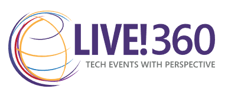

# VS Live 360 - Generative AI for the Enterprise Workshop
This is the repo for the November 17th 2024 All day Workshop for VS Live 360 conference in Orlando, FL.

## Presenter: Lino Tadros

### [LinkedIn](https://www.linkedin.com/in/linotadros/)

## Introduction
“Generative AI is easy!” Look at ChatGPT, you ask a question, you get an answer! How difficult could it be?
Well, for you as an individual, it is very easy and simple to use, but for an enterprise to allow the use of Generative AI, it is very involved to make sure all the pieces involved are secure, scalable, and extensible. There are servers, clusters, APIs, Agents, Datasources, Prompts, Orchestrators, Embedding Models, Vectorization Databases, and many other endpoints that must be put in place and secured to provide reliable answers to questions using Generative AI in a private and secure setting for an organization.

## Day Agenda

|Time Slot|Description|
|---|---|
|9:00 - 9:15|Introductions|
|9:15 - 9:45|Introduction to Generative AI|
|9:45 - 10:15|Working with OpenAI using API|
|10:15 - 11:00|Lab 1 Working with OpenAI using API|
|11:00 - 11:15|Break|
|11:15 - 11:45|Semantic Kernel Fundamentals|
|11:45 - 12:15|Lab 2 Semantic Kernel Fundamentals|
|12:15 - 1:00|Langchain Fundamentals|
|1:00 - 2:00|Lunch|
|2:00 - 2:30|Lab 3 Langchain Fundamentals|
|2:30 - 3:30|RAG Fundamentals|
|3:30 - 4:00|Lab 4 RAG Fundamentals|
|4:00 - 4:15|Break|
|4:15 - 4:45|Embeddings & Vectorization|
|4:45 - 5:15|Lab 5 Embeddings and Vectorization|
|5:15 - 6:00|Final wrap up and answering questions.|

## I hope you enjoy the Workshop!
### Looking forward to seeing you in next year's VS Live 360 conference!